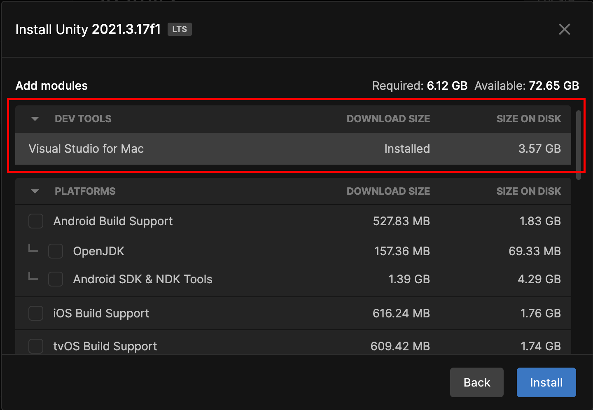
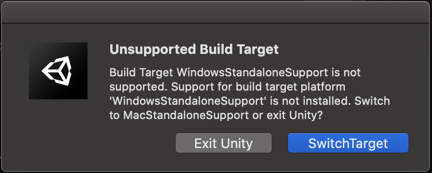

# Arena Lighting
Unity Project that creates virtual light shows of the stadiums as a demo for light show companies such as [Xyloband](https://xylobands.com) and [Pixmob](https://www.pixmob.com).

### Sponsor
Mike ... [Contact Email](mailto:musicmattersbookings@gmail.com)

### Spring 2023 Team Developers
- Devin Spivey.
- Nick Buhl.
- Kazybek Mizam.
- Jack Woods.

### Skills required
- Unity
- C#

### How to setup environment
1. Clone this GitHub repository to your machine ([GitHub Desktop](https://desktop.github.com) is recommended).
2. Create new branch from main branch (you will see why later).
2. Download [Unity](https://unity.com/download).
3. Open the Unity Hub and create or sign in to existing Unity ID account.
> :point_up: When installing Unity Editor, install Visual Studio for Windows or MacOS since it highlights and show hints during development. 

### How to open Unity project
1. Open the project. 
2. Navigate to this repository and select stadium folder. 
3. Ensure that you have project version installed and selected. 
4. Click once and wait till project opens.
5. If you have this warning click switch target. 
The Unity Editor is a cross platform software, therefore once opens the project, it will change some files in order to open project your current OS. Since you have created separate branch, files that are changed should not affect the main branch.