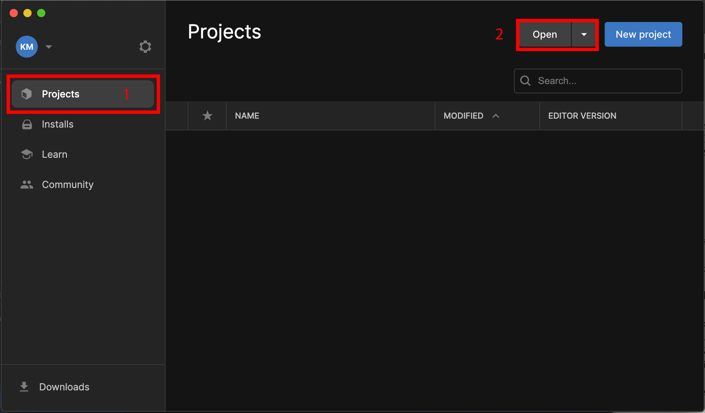
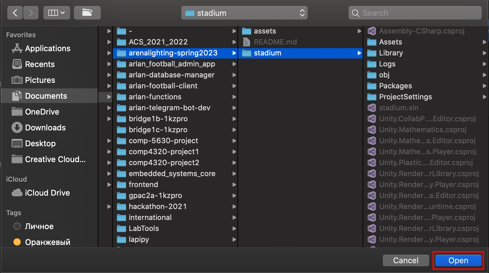
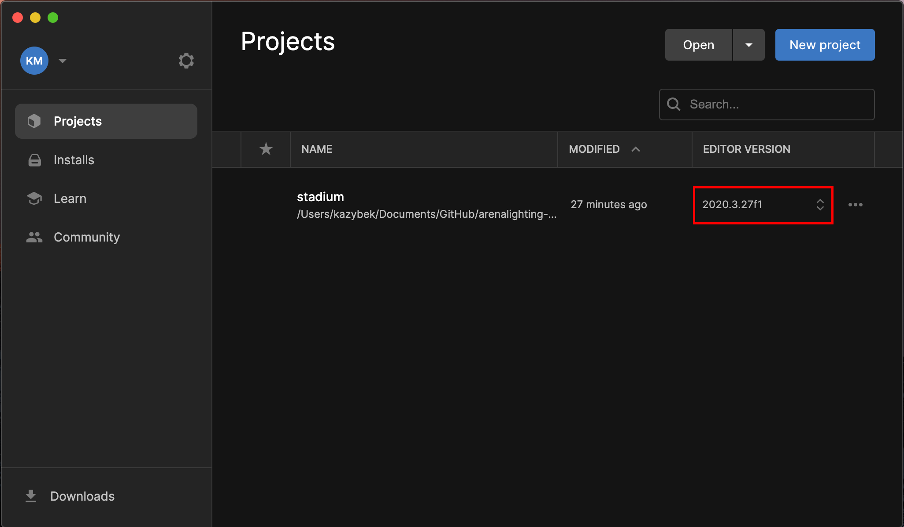

# Arena Lighting

### Skills required
- Unity
- C#

### How to setup environment
1. Clone this GitHub repository to your machine (GitHub Desktop is recommended).
2. Download [unity](https://unity.com/download).
3. Create or Sign in to existing Unity Hub.
4. Open the project 
5. Navigate to this repository and select stadium folder .
6. Ensure that you have compatible unity version installed .
7. Click once and project will open.
